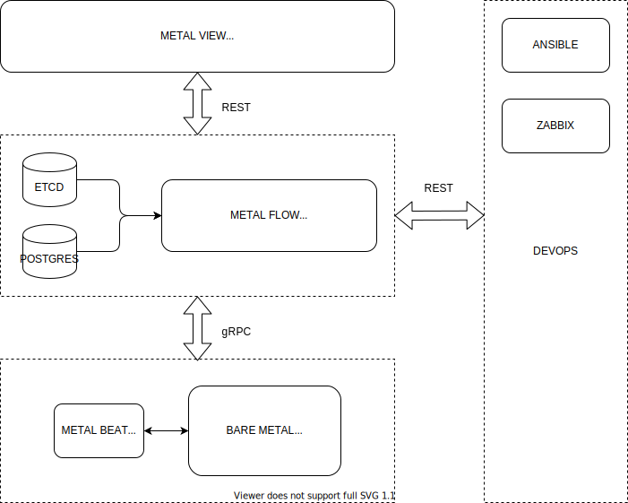

# metalflow

[](https://github.com/craftslab/metalflow/actions?query=workflow%3ACI)
[](https://hub.docker.com/r/craftslab/metalflow)
[](https://goreportcard.com/report/github.com/craftslab/metalflow)
[](https://github.com/craftslab/metalflow/blob/master/LICENSE)
[](https://github.com/craftslab/metalflow/tags)


## Introduction

*metalflow* is a metal server written in Go.

See *[metalbeat](https://github.com/craftslab/metalbeat/)* as an agent of *metalflow*.
See *[metalview](https://github.com/craftslab/metalview/)* as a view of *metalflow*.


## Requirement

- Gin >= 1.6.0
- Go >= 1.15.0


## Run

```bash
TODO
```


### Docker

```
TODO
```


## Usage

```bash
TODO
```


## Design




## License

Project License can be found [here](LICENSE).


## Reference

- [Swaggo](https://github.com/swaggo/swag/tree/master/example)
