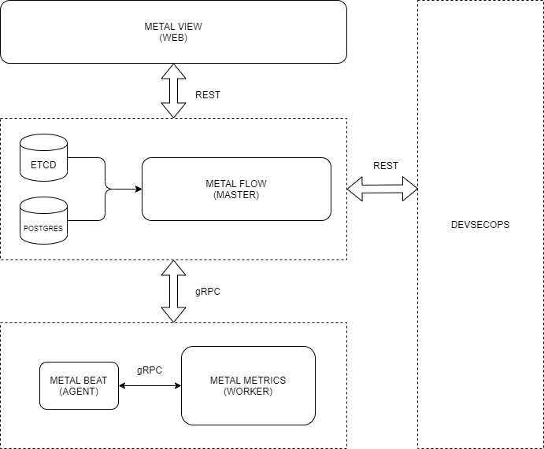

# metalflow

[](https://github.com/craftslab/metalflow/actions?query=workflow%3ACI)
[](https://hub.docker.com/r/craftslab/metalflow)
[](https://goreportcard.com/report/github.com/craftslab/metalflow)
[](https://github.com/craftslab/metalflow/blob/master/LICENSE)
[](https://github.com/craftslab/metalflow/tags)


## Introduction

*metalflow* is a master of *[metalbeat](https://github.com/craftslab/metalbeat/)* written in Go.

- See *[metalbeat](https://github.com/craftslab/metalbeat/)* as an agent of *metalflow*.
- See *[metalmetrics-py](https://github.com/craftslab/metalmetrics-py/)* as a worker of *metalflow*.
- See *[metalview](https://github.com/craftslab/metalview/)* as a view of *metalflow*.


## Prerequisites

- Gin >= 1.6.0
- Go >= 1.15.0
- GORM >= 1.20.11
- PostgreSQL >= 12.5
- etcd == 3.3.25
- gRPC == 1.26.0


## Build

```bash
git clone https://github.com/craftslab/metalflow.git

cd metalflow
make build
```


## Run

```bash
./metalflow --config-file="config.yml" --listen-url="127.0.0.1:9080"
```


## Docker

```bash
git clone https://github.com/craftslab/metalflow.git

cd metalflow
docker build --no-cache -f Dockerfile -t craftslab/metalflow:latest .
docker run -it -p 9080:9080 craftslab/metalflow:latest ./bin/metalflow --config-file="./etc/config.yml" --listen-url="127.0.0.1:9080"
```


## Stack

```bash
docker swarm init

mkdir -p /var/lib/postgresql/data
docker stack deploy -c Dockerstack.yml metalflow
docker stack services metalflow
docker stack rm metalflow

docker swarm leave --force
```


## Usage

```
usage: metalflow --config-file=CONFIG-FILE [<flags>]

Metal Flow

Flags:
  --help                     Show context-sensitive help (also try --help-long
                             and --help-man).
  --version                  Show application version.
  --config-file=CONFIG-FILE  Config file (.yml)
  --listen-url=":9080"       Listen url
```


## Settings

*metalflow* parameters can be set in the directory [config](https://github.com/craftslab/metalflow/blob/master/config).

An example of configuration in [config.yml](https://github.com/craftslab/metalflow/blob/master/config/config.yml):

```yaml
apiVersion: v1
kind: master
metadata:
  name: metalflow
spec:
  etcd:
    host: 127.0.0.1
    port: 2379
  postgres:
    host: 127.0.0.1
    port: 5432
    user: postgres
    pass: postgres
    db: metalflow
```


## Design




## Etcd

- Agent

```
key: /metalflow/agent/{HOST}/register
val: metalbeat
```

- Master

```
key: /metalflow/worker/{HOST}/dispatch
val: {COMMAND}
```


## PostgreSQL

- Admin

```
pgAdmin: http://127.0.0.1:8080

user: user@domain.com
pass: postgres
```

- Backup

```bash
pg_dump -h 127.0.0.1 -p 5432 -U postgres -d metalflow -E utf8 -F t -b -v -f metalflow.tar
```

- Restore

```bash
pg_restore -h 127.0.0.1 -p 5432 -U postgres -O -d metalflow -v metalflow.tar
```


## Swagger

```
http://127.0.0.1:9080/swagger/index.html
```


## License

Project License can be found [here](LICENSE).


## Reference

- [etcd](https://etcd.io/docs/)
- [go-kit](https://github.com/go-kit/kit)
- [go-zero](https://github.com/tal-tech/go-zero)
- [gRPC](https://grpc.io/docs/languages/go/)
- [pgAdmin](https://hub.docker.com/r/dpage/pgadmin4/)
- [postgresql](https://hub.docker.com/_/postgres)
- [protobuf](https://developers.google.com/protocol-buffers/docs/proto3)
- [stack](https://docs.docker.com/engine/swarm/stack-deploy/)
- [swag](https://github.com/swaggo/swag)
